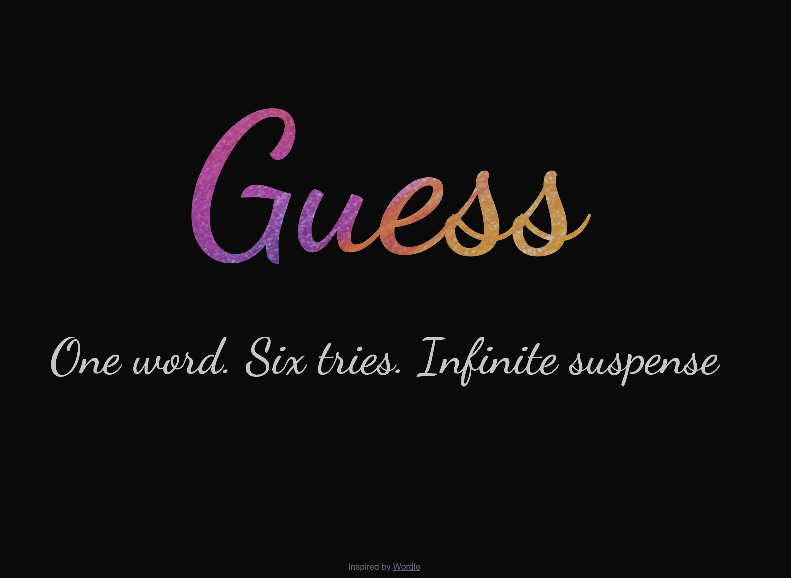
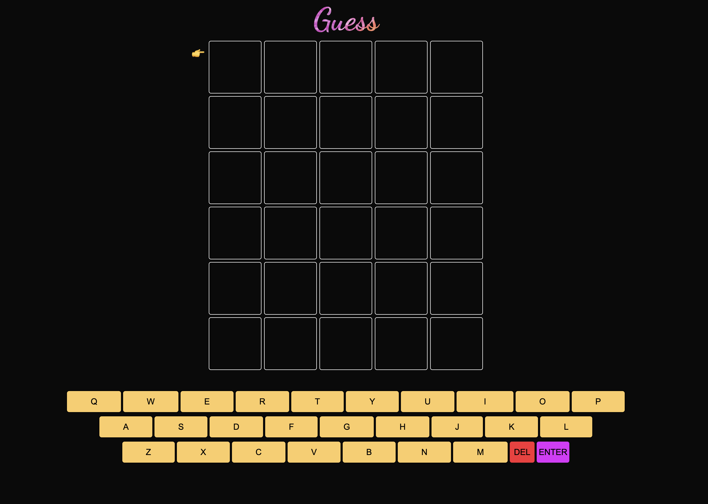

# Guess

A modern, interactive word guessing game built with Next.js and TypeScript, featuring animations, hints, and a sleek user interface.

## 🎮 Features

- 🎯 Classic word guessing gameplay with 6 attempts
- ✨ Animated transitions and interactions using Framer Motion
- 💡 Smart hint system that activates on the second-to-last guess
- ⌨️ Virtual keyboard with full keyboard support
- 🎊 Victory celebration with confetti effects
- 📱 Responsive design for both desktop and mobile
- 🎨 Clean and modern UI with smooth animations
- 🔄 Restart game functionality
- 👋 Welcoming first-page animation

## 🛠️ Built With

- [React](https://reactjs.org/) - Frontend framework
- [TypeScript](https://www.typescriptlang.org/) - Type safety and enhanced development experience
- [Next.js](https://nextjs.org/) - React framework for production
- [Framer Motion](https://www.framer.com/motion/) - Animation library
- [Canvas Confetti](https://www.npmjs.com/package/canvas-confetti) - Celebration effects
- [Tailwind CSS](https://tailwindcss.com/) - Styling
- [Lucide React](https://lucide.dev/) - Icons

## 🚀 Getting Started

### Prerequisites

- Node.js (v14 or higher)
- npm

### Installation

1. Clone the repository
2. Install dependencies (npm install)
3. Start the development server
4. Open [http://localhost:3000](http://localhost:3000) in your browser

## 🎯 How to Play

1. The game starts with a welcome animation
2. Try to guess the 5-letter word
3. After each guess:
    - Green: Letter is correct and in the right position
    - Yellow: Letter is in the word but in wrong position
    - Gray: Letter is not in the word
4. You have 6 attempts to guess the word
5. A hint will appear before your last attempt
6. Win by guessing the word correctly!

## 🔧 Game Controls

- Type letters using your keyboard or the on-screen keyboard
- Press Enter/click Enter to submit your guess
- Press Backspace/click DEL to delete letters
- Click the refresh icon to start a new game
- Click the help icon for assistance

## ⚙️ API Endpoints

- `GET /api` - Fetches random words
- `POST /api/solution` - Submits solution 
- `POST /api` - Fetches hints

## 🎨 Customization

The game includes several customizable features:
- Word length (currently set to 5)
- Maximum guesses (currently set to 6)
- Hint timing
- Animation durations
- Color schemes (via Tailwind classes)

## 🤝 Contributing

Contributions are welcome! Please feel free to submit a Pull Request.

1. Fork the Project
2. Create your Feature Branch (`git checkout -b feature/AmazingFeature`)
3. Commit your Changes (`git commit -m 'Add some AmazingFeature'`)
4. Push to the Branch (`git push origin feature/AmazingFeature`)
5. Open a Pull Request

## 📧 Contact

Your Name - [@YourTwitter](https://twitter.com/YourTwitter)

Project Link: [https://github.com/YourUsername/your-repo-name](https://github.com/YourUsername/your-repo-name)

## 🙏 Acknowledgments

- Inspired by the original Wordle game
- Thanks to all the open-source libraries used in this project
